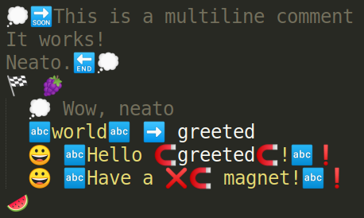

# Emojicode Sublime Syntax
:grapes: Syntax files for the [Emojicode language](http://www.emojicode.org/).
# 

## Installation
Copy the `Emojicode` directory into the Sublime Text packages directory.
You can navigate to this directory directly via Sublime's Browse Packages command from the command palette.

## Features

### Comments
Both `💭 line` and `💭🔜 block 🔚💭` -style comments are highlighted, and are supported by Sublime's "Toggle Comment" command.

### Strings
String literals (delimited by `🔤`s) are highlighted, and appropriately ignore escaped delimiters, ie `❌🔤`.
Highlighting for string literal interpolation `🧲like_so🧲` is also supported.

### Indentation
Lines following a block opening `🍇` will be indented, and appropriately dedented at the end of the block `🍉`.
